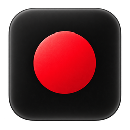
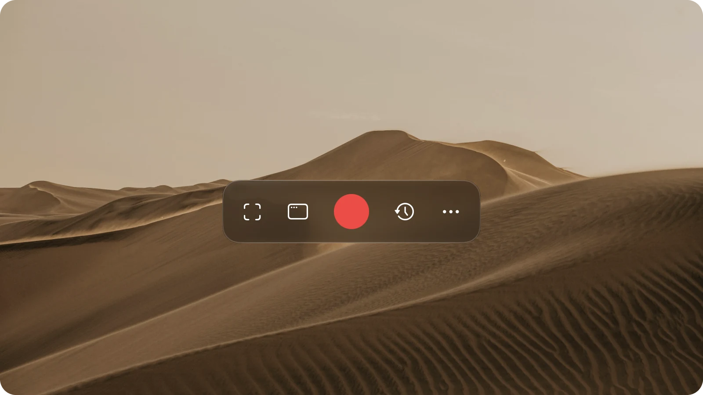

<p align="center">
  
</p>

<h1 align="center">KapKap</h1>

<p align="center">A native macOS screen recorder for Apple Silicon, rebuilt in Swift from Kap.</p>

<p align="center">
  
</p>

A native Swift fork of [Kap](https://github.com/wulkano/Kap), the open-source screen recorder,
for Apple Silicon Macs. It is a rewrite rather than a copy of Kap's code: SwiftUI interface,
ScreenCaptureKit capture and AVFoundation recording instead of Electron and Node.js.

## Why this fork

Kap is no longer maintained. Its last release, 3.6.0, shipped on 27 October 2022, and nothing
but a CI configuration change has landed since; more than 250 issues are open, and users have been
[asking whether the project is abandoned](https://github.com/wulkano/Kap/issues/1265).
It does not work properly on current macOS: on macOS 27 it
[crashes](https://github.com/wulkano/Kap/issues/1293) and hits
[unhandled promise rejections](https://github.com/wulkano/Kap/issues/1294), and people report it
[failing on recent Apple Silicon Macs](https://github.com/wulkano/Kap/issues/1290).

Rather than patch an aging Electron app, KapKap rebuilds the recorder natively on the frameworks
macOS provides for this today, so it keeps working as the system moves on.

## Not at feature parity with Kap

KapKap is not a full fork: it covers recording, trimming and exporting, and leaves out much of
what Kap does around them. Missing compared with Kap:

- **Plugins.** There is no plugin system, so none of Kap's share plugins (Dropbox, Giphy,
  Streamable, Imgur and others), editing plugins or recording plugins (camera overlay, hiding
  desktop icons, Do Not Disturb) are available. Exports can be saved, copied or opened in another app.
- **Lossy GIF compression.** Kap shrinks GIFs with gifsicle; KapKap exports them losslessly only.
- **Exports window.** No list of running and finished exports with progress.
- **Intel Macs.** Apple Silicon only.
- **Migration.** Kap's settings and recording history are not imported.

## Development

Open `Package.swift` in Xcode, or use:

```sh
./script/build_and_run.sh
swift test
```

Requirements: Apple Silicon, Xcode 27 / Swift 6.4 for this development build,
and an ARM Homebrew FFmpeg installation (`brew install ffmpeg`). The build script
copies FFmpeg and its linked libraries into the app and checks every binary for ARM
support. The resulting local `.app` does not need Homebrew at runtime.

The app is staged at `dist/KapKap.app`. The build uses the sole Apple Development
identity in the keychain, or an explicit `KAPKAP_SIGNING_IDENTITY`. A stable certificate
keeps the application's identity consistent across rebuilds for macOS privacy permissions.
Without a certificate it falls back to ad-hoc signing, which can require granting access
again after code changes. The first switch from ad-hoc to certificate signing may also
require renewing the permission once.
`--build-only` builds without opening it; `--verify` checks the launched process.
The Codex Run action uses the same script.

## Recording

1. The last selected area is restored on launch. Before an area is saved, the built-in display is selected (otherwise the main display). You can select a new area, display or window.
2. Enable system audio, the microphone, the cursor or click highlighting in Settings (the ⋯ button
   on the panel). With system audio and the microphone both on, each gets its own track and
   exports mix them. Recording and export share one set of
   frame rates — 60, 30, 24 and 15 fps; the editor never offers more than the recording holds.
3. Press Record. Grant Screen Recording and, optionally, Microphone access when macOS asks.
4. Pause/resume or stop from the recorder window or menu bar.
5. The recording is saved automatically and opens in the editor.

Two global shortcuts work from any app: start/stop recording (**⌃⌥⌘R**) and select a recording
area (**⌃⌥⌘A**). Change either in Settings → Shortcuts by clicking its button and pressing
Command or Control with a letter or number; Escape cancels.
The choice persists across launches. A registration conflict keeps the previous choice;
shortcuts handled locally by another app cannot always be detected.
Left-clicking the menu-bar icon opens the recorder panel; while recording it stops. Right-click opens the menu. The source menu also
lets you return to the last area after choosing a display or window. A disconnected display
or a saved area outside the current display bounds requires selecting a new area.

The window picker lists one entry per app with an on-screen window, front to back. Choosing one
activates that app and outlines the window that will be captured; the recorder panel stays on top.
While an area is being drawn or resized, the selection panel fades out of the way.

Originals are stored in `~/Library/Application Support/KapKap/Recordings`.
Unfinished files have a leading dot and are retained for diagnosis rather than silently deleted.
Exports preserve the original file. The editor supports trimming, resolution, frame rate,
mute, and MP4, GIF, APNG, WebM, HEVC and AV1 export. A finished export plays a system sound.
Closing the editor while its own recording has never been exported asks first, and offers to keep
it in Recent recordings or move it to the Trash; imported videos are never touched. The export
menu can also open the result straight in another app (Open With). The save dialog starts in
the export folder chosen in Settings → General (`~/Movies/KapKap` by default), where GIF and APNG
looping can be turned off and KapKap can be set to launch at login. The recorder
panel hides while an editor window is open. Recent recordings is a list with a 16:9 poster frame per row and can
reveal a file in Finder or copy it to the clipboard.

## Architecture

- `CaptureCore`: display coordinates, shared pause timeline, export options, tests.
- `Sources/KapKap/Recording`: ScreenCaptureKit session and serial AVAssetWriter pipeline.
- `Sources/KapKap/Views`: SwiftUI recorder, settings, window picker, library and editor.
- `Sources/KapKap/Stores`: observable recording and editor state.
- `Sources/KapKap/Selection`: SwiftUI selection drawing and gestures; a small AppKit adapter
  creates borderless windows across displays, sets their level and handles Escape.
- `Sources/KapKap/Export`: cancellable bundled ARM FFmpeg execution and atomic export.

SwiftUI owns all screens and controls. AppKit is used narrowly for desktop overlay
placement, app lifecycle, and macOS file dialogs / Finder integration.

## Scope and verification

This is the first native implementation, not a feature-complete or pixel-identical Kap port.
Tests cover display coordinates, pause timing, static-screen duration, empty recordings, and
encode/decode round trips for all six export formats using a generated video/audio fixture.
Build the app before testing so the bundled export executable is available.

Full visual parity, editable selection handles/aspect ratios, original Kap settings/history migration, crash recovery, and signed public
distribution remain follow-up work. Real screen/microphone capture and multi-monitor
behavior require permissions and on-device testing; a successful build alone is not evidence
that those scenarios work.

See `THIRD_PARTY_NOTICES.md` before distributing an export-enabled build.

## Acknowledgements

KapKap exists because of [Kap](https://github.com/wulkano/Kap) by [Wulkano](https://wulkano.com)
and its contributors: the interface, the workflow and the idea of a small, friendly recorder
all come from there. Thank you. Kap is MIT-licensed; its notice is in `THIRD_PARTY_NOTICES.md`.

The README screenshot's background is [Deserto de Huacachina](https://unsplash.com/photos/brown-sand-dunes-under-white-sky-during-daytime-GeReAnOMiZ8)
by [Ze Paulo](https://unsplash.com/@euzepaulo) on Unsplash.
