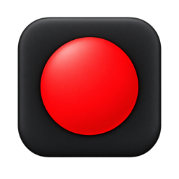
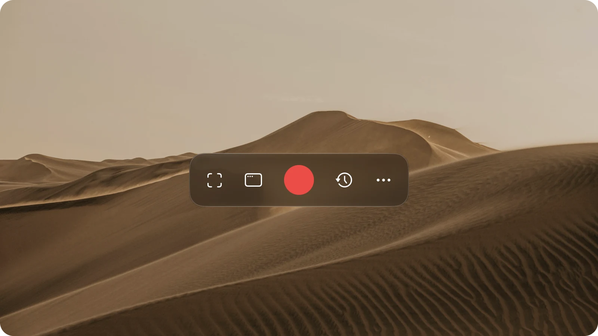

<p align="center">
  
</p>

<h1 align="center">KapKap</h1>

<p align="center">A native macOS screen recorder for Apple Silicon.<br>Free, open source, inspired by <a href="https://github.com/wulkano/Kap">Kap</a>.</p>

<p align="center"><a href="https://github.com/design-ninja/KapKap/releases/latest"><b>Download the latest release</b></a> · macOS 15 or later</p>

<p align="center">
  
</p>

## Features

- 🎯 **Record anything:** an area, a window or a whole display, at 15 to 60 fps
- 🔊 **Sound:** system audio and the microphone, each on its own track
- 🖱️ **Cursor and clicks:** show the cursor and highlight clicks
- ✂️ **Editor:** trim, resize, change the frame rate and quality, mute, see the file size before you export
- 📦 **Export:** MP4, GIF, APNG, WebM, HEVC or AV1, with fast hardware encoding for MP4 and HEVC
  and lossy compression for smaller GIFs
- ⌨️ **Global shortcuts:** start, stop and select an area from any app
- 🛟 **Never lose a take:** recordings survive a crash, a quit or a shutdown
- 🔄 **Updates itself**, and lives in the menu bar

## Install

1. Download `KapKap-<version>.zip` from the [latest release](https://github.com/design-ninja/KapKap/releases/latest).
2. Unzip it and move KapKap to Applications.
3. Open it. The first time you record, allow **Screen Recording** (and the **Microphone**, if you
   use it) when macOS asks.

Builds are signed with Developer ID and notarized by Apple. KapKap checks GitHub for new versions
and asks before installing them; you can turn this off in Settings → General.

## How to use

1. **Choose what to record.** Draw an area, pick a window or a display. KapKap remembers the last area.
2. **Press Record.** A short sound marks the start; it's not in the recording. The panel hides so it never gets in the shot.
3. **Stop** with the menu-bar icon (it shows the elapsed time) or **⌃⇧R**. Option-click the icon to pause.
4. **Edit and export.** The recording opens in the editor, already saved.

| Shortcut | Action |
| --- | --- |
| **⌃⇧R** | Start or stop recording |
| **⌃⇧A** | Select a recording area |
| Click the menu-bar icon | Open the recorder, or stop while recording |
| Option-click | Pause or resume |
| Right-click | Menu |

Audio, cursor, click highlighting, frame rate and recording quality live in Settings (the **⋯** button on the panel).

<details>
<summary><b>Recording details</b></summary>

- **Starting area.** On launch KapKap restores the last area. Until one is saved, it picks the
  built-in display (otherwise the main display). Settings → Recording can switch back to the last
  area after you chose a display or window.
- **Windows.** The window picker lists one entry per app with an on-screen window, front to back.
  Choosing one brings the app forward and outlines the window that will be captured; the recorder
  panel stays on top. While you draw or resize an area, the panel fades out of the way.
- **Changed displays.** The display is measured again when recording starts: a whole display
  follows a new resolution, while a disconnected display, or an area on a display whose resolution
  changed, needs a new selection.
- **Audio.** With system audio and the microphone both on, each gets its own track, and exports
  mix them.
- **Frame rate.** Recording and export share 60, 30, 24 and 15 fps; the editor never offers more
  than the recording holds.
- **Recording quality.** Standard or High. High doubles the bit rate for games and video, where
  Standard can soften fine detail, and makes files twice as big. An export can't restore detail
  the recording lacks.

</details>

<details>
<summary><b>Editing and exporting</b></summary>

- **Remembered settings:** the format, frame rate, quality and destination you chose last are
  kept for the next recording. GIF and video keep separate qualities, so a light GIF and a sharp
  MP4 don't overwrite each other. A reduced frame rate the next recording can't reach falls back to
  its native rate.
- **Quality:** smaller file, balanced or best, for video and GIF. Balanced and Smaller file shrink
  GIFs with Gifsicle, like Kap's "Lossy GIF compression": Balanced makes them about a quarter
  smaller at the same quality, and Best quality leaves them as FFmpeg wrote them. See
  [docs/export-quality.md](docs/export-quality.md) for what each one means.
- **Fast Hardware Encoding** (MP4 and HEVC, in the quality menu) uses the Mac's media engine: two to
  four times faster for game and video footage, at a bigger file for the same detail.
- **Where it goes:** save, copy to the clipboard, or open straight in another app (Open With). The
  save dialog starts in the export folder from Settings → General (the Desktop by default).
- **Looping** for GIF and APNG can be turned off in Settings → General, which is also where KapKap
  can be set to launch at login.
- Exports never change the original, and a finished export plays a sound. The recorder panel hides
  while an editor is open.
- Closing the editor before a recording was ever exported asks whether to keep it in Recent
  recordings or move it to the Trash. Imported videos are never touched.

</details>

<details>
<summary><b>Shortcuts</b></summary>

Change either shortcut in Settings → Shortcuts: click its button and press Command or Control with
a letter or number; Escape cancels. The label always shows the Latin letter, whatever keyboard
layout is active. If the new shortcut can't be registered, the previous one stays. Shortcuts that
another app handles on its own can't always be detected.

</details>

<details>
<summary><b>Where files live and what happens if something goes wrong</b></summary>

- **Originals** are in `~/Library/Application Support/KapKap/Recordings`. Recent recordings (the
  clock button on the panel) shows them with a poster frame and can reveal or copy each one.
- **Crash-safe.** Recordings are written in two-second fragments. If KapKap quits unexpectedly, the
  unfinished file is recovered into Recent recordings at the next launch. A file that can't play
  keeps its name starting with a dot, for diagnosis.
- **Quit, log out or shut down** during a recording, and it's saved first.
- **Stopped by macOS** (from the system's screen-recording controls, or when a display
  disconnects): everything recorded so far is saved, and KapKap says why it stopped.
- **Temporary copies** for the clipboard and Open With live in `~/Library/Application Support/KapKap`.
  A new clipboard copy replaces the previous one, and the rest are removed after a day.

</details>

## How it differs from Kap

KapKap covers recording, trimming and exporting, and leaves out some of what Kap does around them:

- **No plugins,** so none of Kap's share plugins (Dropbox, Giphy, Streamable, Imgur and others),
  editing or recording plugins. Exports can be saved, copied or opened in another app.
- **No Exports window** listing running and finished exports; progress shows in the editor.
- **Apple Silicon only,** no Intel Macs.

## Development

```sh
brew install pkg-config cmake meson ninja
./script/build_and_run.sh
swift test
```

Needs Apple Silicon and Xcode 27. The first build compiles the bundled FFmpeg and Gifsicle from
source, which takes a few minutes. Signing, debug builds, architecture, tests and releases are covered in
[docs/DEVELOPMENT.md](docs/DEVELOPMENT.md).

## License

KapKap is [MIT-licensed](LICENSE). The bundled FFmpeg, its codecs and Gifsicle keep their own
licenses (GPL for FFmpeg, x264, x265 and Gifsicle); see [THIRD_PARTY_NOTICES.md](THIRD_PARTY_NOTICES.md).
Each release ships their sources.

## Acknowledgements

Thank you to [Kap](https://github.com/wulkano/Kap) by [Wulkano](https://wulkano.com) and its
contributors: KapKap is inspired by it. Kap is MIT-licensed; its notice and the licenses of
everything bundled, including FFmpeg and Gifsicle, are in [THIRD_PARTY_NOTICES.md](THIRD_PARTY_NOTICES.md).

The screenshot's background is [Deserto de Huacachina](https://unsplash.com/photos/brown-sand-dunes-under-white-sky-during-daytime-GeReAnOMiZ8)
by [Ze Paulo](https://unsplash.com/@euzepaulo) on Unsplash.
